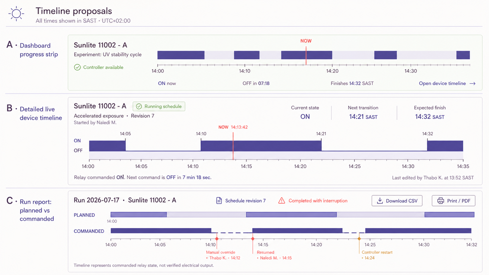

# Authentication, Audit, Time, Timeline, and Reporting

Status: time contract implemented; remaining work deferred  
Last reviewed: 2026-07-28

This proposal extends Sunlite Scheduler with individual user accounts, attributable changes, authoritative timezone handling, useful live timelines, and run reporting.

## Decisions

- Keep scheduling and execution timestamps in UTC.
- Interpret entered wall-clock times on the server using the schedule's IANA timezone.
- Display South African experiments as `SAST · UTC+02:00`.
- Give every person a unique account; do not use shared accounts.
- Allow last-write-wins editing, but preserve who changed what and every revision.
- Distinguish commanded relay state from verified electrical or optical output.
- Use the compact timeline on the dashboard, the detailed timeline on device pages, and planned-versus-commanded tracks in reports.

## Authoritative time contract

The browser must submit the entered local wall time unchanged together with `timezone = "Africa/Johannesburg"`. It must not convert the input with the browser's local timezone.

The backend attaches the IANA timezone using Python `zoneinfo`, validates the local time, and converts the resulting instant to UTC. The database stores both the UTC instant and originating timezone. The controller compares UTC instants against an NTP-synchronised Raspberry Pi clock. Displays and exports convert the stored instant through the saved timezone.

Example invariant:

- Entered: `2026-07-20 08:00 Africa/Johannesburg`
- Stored and executed: `2026-07-20 06:00 UTC`
- Displayed: `2026-07-20 08:00 SAST`

Fractional schedule durations represent elapsed time and are independent of timezone.

Required verification:

- SAST-to-UTC-to-SAST round trips;
- browsers configured for timezones outside South Africa;
- Raspberry Pi local timezone independence;
- service restart and recovery at schedule boundaries;
- correct date rollover around midnight;
- UTC clock, configured timezone, and NTP status on the System page;
- consistent SAST labels on timelines, reports, and exports.

## Local user authentication

- Require a unique username and password for every scientist or administrator.
- Store stable user ID, username, display name, role, password hash, active state, creation time, and last login.
- Hash passwords using Argon2id with unique salts.
- Use opaque, random, server-side sessions in HttpOnly and SameSite cookies.
- Apply idle and absolute expiry, logout, session revocation, login throttling, and CSRF protection.
- Keep health checks and static assets unauthenticated; require authentication for the application and operational APIs.
- Bootstrap the first administrator through a local CLI command with no default password.
- Let administrators create and disable users, reset passwords, and revoke sessions.
- Start with two roles:
  - `administrator`: operator permissions plus user administration;
  - `operator`: schedules, controls, history, and reports.
- Keep authentication independent of LAN, Tailscale, or Cloudflare access.
- Use HTTPS whenever passwords travel outside an explicitly trusted and isolated lab network.

## Attribution and overwrite history

Concurrent edits remain last-write-wins. The system records and explains every accepted change instead of blocking a later editor.

Each schedule carries:

- revision number;
- created and updated UTC timestamps;
- creator and last editor;
- the revision used by each run.

Each audit event records:

- authenticated user ID and display name;
- UTC timestamp with SAST presentation;
- action, object type, and object ID;
- request ID;
- previous and new revision;
- structured before/after snapshots or field-level changes.

Audit schedule creation, editing, deletion, enable/disable, Stop All, resume, device stop/pause/resume, manual overrides, fault clearing, login/logout, failed login, password reset, and user administration.

Schedule rows and editors show `Last edited by <name> at <SAST time>`. If the loaded revision has since changed, the new save still succeeds and identifies the intervening revision and its editor. All revisions remain available through the audit view.

Audit history is append-only through application APIs, included in backups, and filterable by user, simulator, schedule, action, and date. Passwords, password hashes, session tokens, and credentials must never appear in audit records.

## Timeline design

### Dashboard

- Compact proportional ON/OFF strip for each active device.
- Moving Now marker.
- Current commanded state.
- Countdown to the next transition.
- Expected finish time.
- Explicit `No active schedule` presentation when idle.

### Device page

- Full-width proportional ON/OFF timeline.
- SAST time axis.
- Moving Now marker updated locally each second.
- Run start, next transition, and expected completion.
- Live refresh when state or schedule data changes.
- Accessible text summary beside or below the graph.
- Last editor and schedule revision context.

### Run report

- Planned state as a thin reference track.
- Commanded relay state as the primary track.
- Mark manual overrides, interruptions, restart recovery, and Stop actions with actor and time.
- State clearly that the graph is commanded relay state, not verified hardware output.

## Run reporting and export

Create a commanded-transition ledger linked to each run. Record:

- planned transition time;
- actual command time;
- commanded state;
- transition source;
- run ID;
- schedule revision;
- responsible user when applicable.

Reports support filters for simulator, schedule, user, date range, and outcome. A run summary includes planned and actual start/end, start delay, duration, commanded ON time, interruptions, completion status, schedule owner, last editor, and revision used.

Initial export formats:

- CSV;
- print-ready HTML for browser PDF generation.

Native PDF generation remains optional unless browser PDFs prove insufficient.

## Optional email delivery

- Send completed-run reports or daily summaries.
- Keep SMTP credentials in protected Raspberry Pi configuration outside source control.
- Queue failed messages for retry and audit delivery outcomes.
- Attach CSV or PDF according to lab policy.
- Implement only after report fields and layout are accepted.

## Deferred implementation checklist

- [x] Implement and verify the authoritative wall-time-to-UTC contract
- [ ] Add local users, password hashing, roles, and sessions
- [ ] Add revisioned schedules and structured audit history
- [ ] Replace static dashboard and device timelines
- [ ] Add the commanded-transition ledger
- [ ] Add report filtering and CSV/print export
- [ ] Review whether native PDF is necessary
- [ ] Review and implement optional email delivery

## Recommended sequence

1. Time contract and tests
2. Authentication and session management
3. Revisioned attribution and audit
4. Live dashboard and device timelines
5. Run ledger, reports, and exports
6. Optional email delivery

## References

- [Python `zoneinfo`](https://docs.python.org/3/library/zoneinfo.html)
- [OWASP Password Storage Cheat Sheet](https://cheatsheetseries.owasp.org/cheatsheets/Password_Storage_Cheat_Sheet.html)
- [OWASP Authentication Cheat Sheet](https://cheatsheetseries.owasp.org/cheatsheets/Authentication_Cheat_Sheet.html)
- [OWASP Session Management Cheat Sheet](https://cheatsheetseries.owasp.org/cheatsheets/Session_Management_Cheat_Sheet.html)
